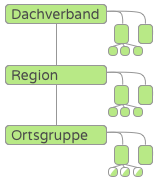
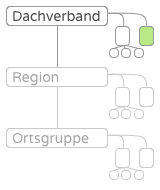
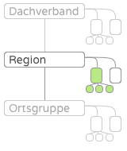
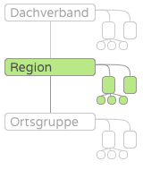
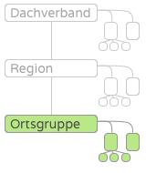
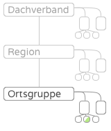
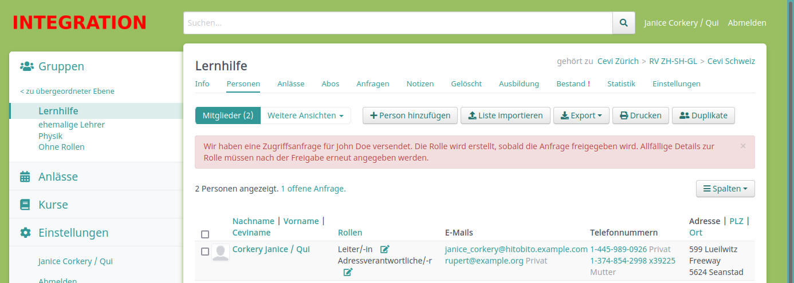
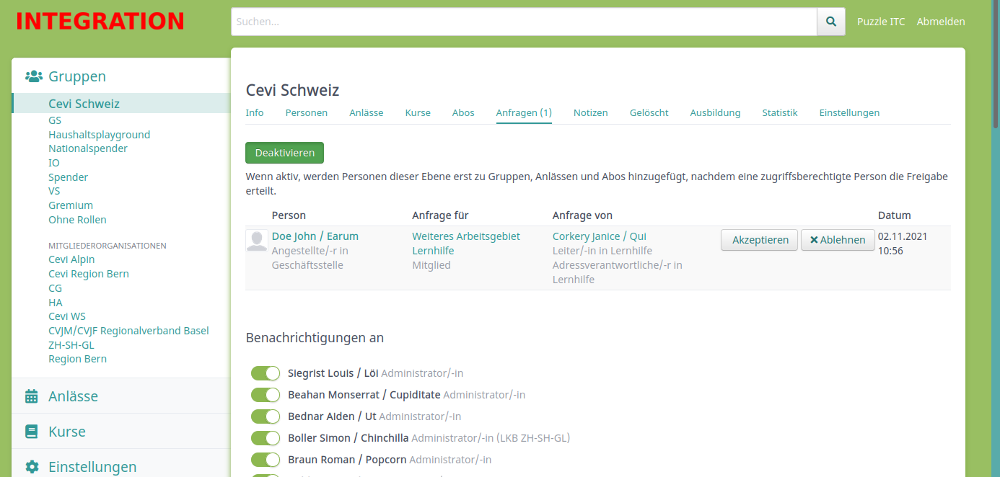

Berechtigungskonzept
=======================

Gruppen / Rollen - Wie funktioniert das?
-------------------------------------------------

In hitobito können komplexe hierarchische Organisationen abgebildet werden. Alles basiert darauf, dass wir verschiedene Gruppentypen zulassen, welche auch definieren welche Rollen zur Verfügung stehen.

- Jede Organisation kann aus mehreren Ebenen bestehen, z. B. Dachverband, Kantonalverband (, optionale Zwischenstufen wie Regionen) und Ortsgruppen.
- Jede Ebene kann intern wieder ihre innere Struktur haben, es gibt einen Vorstand, Arbeitsgruppen, Mitgliederlisten, Kontaktlisten.
- Jede Person hat eine oder mehrere Rollen. Diese Rollen definieren, wen man sehen kann, und von vom man gesehen wird.

Grundsätzlich gilt in Hitobito aber:

- Kann jemand eine Person sehen, sieht er alle Informationen
- Kann jemand eine Person bearbeiten, kann er alle Atribute bearbeiten

Die Organisation sieht in seiner Grundform folgendermassen aus:

**Hauptebene**

- Administrator*in: [:admin, :layer_and_below_full, :impersonation]

- Vorstand

  - Präsident*in: [:layer_full, :contact_data]
  - Vizepräsident*in: [:layer_full, :contact_data]
  - Sekretär*in: [:layer_full, :contact_data]
  - Kassier*in: [:layer_read, :contact_data, :finance]
  - Vorstandsmitglied: [:layer_full, :contact_data]

- Geschäftsstelle

  - Leitung: [:layer_and_below_full, :admin, :contact_data, :approve_applications, :finance]
  - Kassier*in: [:layer_and_below_full, :contact_data, :finance]
  - Mitglied: [:layer_and_below_full, :contact_data, :approve_applications]

- Gremium/Projektgruppe

  - Leitung: [:group_and_below_full, :contact_data]
  - Mitglied: [:group_and_below_read, :contact_data]

- Mitglieder

  - Adressverwaltung: [:group_and_below_full]
  - Aktivmitglied: []
  - Passivmitglied: []

- Kontakte

  - Adressverwaltung: [:group_and_below_full]
  - Kontakt: []

**Region/Kanton**

  - Administrator*in: [:layer_and_below_full, :contact_data, :finance]

Hier einige Beispiele, wie das aussehen kann:

Karin ist Geschäftsleiter direkt im Dachverband
~~~~~~~~~~~~~~~~~~~~~~~~~~~~~~~~~~~~~~~~~~~~~~~~~~~~~~~~~~~~

technisch: ``layer_and_below_full`` direkt in Dachverband, inkl. ``contact_data``

Karin sieht: 
^^^^^^^^^^^^^^^^^^

Karin hat vollen Zugriff auf ihrer Ebene und auf alle darunter liegenden Ebenen. Dadurch kann sie alle Personen im Dachverband, in Regionen und auf oberster Ebene der Ortsgruppen sehen und ändern.
Nicht sichtbar und änderbar sind für sie alle Personen, die innerhalb einer Ortsgruppe, also in einer Untergruppe unter der Ortsgruppe, aufgehängt sind. 
Da Karin's Rolle als kontaktrelevant geführt ist (sog. ContactData-Flag, siehe unten), kann sie alle anderen Personen mit Kontaktrelevanz sehen, unabhängig von deren Position innerhalb der Struktur. 

Karin sehen:  
^^^^^^^^^^^^^^^^^^

Karin ist für alle anderen Personen mit Rechten innerhalb der Ebene des Dachverbands sichtbar.
Auf Grund der Kontaktrelevanz von Karin's Rolle ist sie ebenfalls für alle anderen kontaktrelevanten Rollen sichtbar. 

Luca ist ein Mitglied in einem Gremium im Dachverband
^^^^^^^^^^^^^^^^^^^^^^^^^^^^^^^^^^^^^^^^^^^^^^^^^^^^^^

technisch: ``group_read`` in Gremium ohne ``contact_data``

Luca sieht: 
^^^^^^^^^^^^^^^^^

Luca sieht alle Mitglieder und Leitung innerhalb des Gremiums. Sonst sieht er niemanden ausserhalb des Gremiums. 

Luca sehen:
^^^^^^^^^^^^^^^^

Luca ist für Personen mit vollen Rechten (``layer_full`` oder ``layer_and_below_full``) für die Dachverbandsebene sicht- und änderbar. Zusätzlich kann die Leitung innerhalb seines Gremiums seine Daten einsehen und ändern (``group_full``). Seine Kollegen mit gleicher Rolle im Gremium sehen seine Daten, können diese aber nicht ändern (``group_read``)

Maria hat eine Rolle in der Region
~~~~~~~~~~~~~~~~~~~~~~~~~~~~~~~~~~~~

technisch: ``group_and_below`` inkl. ``contact_data``

Maria sieht
^^^^^^^^^^^^^^^

Maria kann alle Mitglieder ihrer Gruppe sehen, also alle Mitarbeitenden auf Regionsebene. 

Da Maria's Rolle als kontaktrelevant geführt ist (sog. ContactData-Flag, siehe unten), kann sie alle anderen Personen mit Kontaktrelevanz sehen, unabhängig von deren Position innerhalb der Struktur. 

Maria sehen
^^^^^^^^^^^^^^

Maria ist für alle anderen Personen mit Rechten innerhalb der Ebene des Dachverbands sichtbar.
Auf Grund der Kontaktrelevanz von Maria's Rolle ist sie ebenfalls für alle anderen kontaktrelevanten Rollen sichtbar. 

Petra leitet ein Gremium in der Region
~~~~~~~~~~~~~~~~~~~~~~~~~~~~~~~~~~~~~~~~~~~~~~~~~~~~~~~~

technisch: ``layer_read`` inkl. ``contact_data``

Petra sieht: 
^^^^^^^^^^^^^^^^

Petra sieht alle Personen in der Region inkl. Personen in allfälligen Untergruppen. Sie sieht jedoch keine Personen in Ortsgruppen, welche der Region angehängt sind. 

Da Petra's Rolle als kontaktrelevant geführt ist (sog. ContactData-Flag, siehe unten), kann sie alle anderen Personen mit Kontaktrelevanz sehen, unabhängig von deren Position innerhalb der Struktur. 

Petra sehen
^^^^^^^^^^^^^^^

Petra ist für Personen auf kantonaler oder Dachverbandsebene sichtbar, welche eine Rolle mit Zugriff auf untergeordnete Ebenen besitzen (``layer_and_below``). Zudem sehen alle Personen in der Region, die Rechte innerhalb der Gruppe oder der Ebene besitzen, ihre Daten.

Auf Grund der Kontaktrelevanz von Petra's Rolle ist sie ebenfalls für alle anderen kontaktrelevanten Rollen sichtbar. 

Anna leitet eine Ortsgruppe
~~~~~~~~~~~~~~~~~~~~~~~~~~~~~~~~~~~~~~~~~~~~~~~~~~~~~~~~

technisch: ``layer_full`` incl. ``contact_data``

Anna sieht
^^^^^^^^^^^^^^

Anna sieht alle Personen innerhalb der Ortsgruppe. 

Da Anna's Rolle als kontaktrelevant geführt ist (sog. ContactData-Flag, siehe unten), kann sie alle anderen Personen mit Kontaktrelevanz sehen, unabhängig von deren Position innerhalb der Struktur. 

Anna sehen
^^^^^^^^^^^^^

Anna ist für Personen oberhalb der Ortsgruppe sichtbar, falls diese das Recht besitzen, Personen unterhalb ihrer Ebene zu sehen.
Zudem können ihre Kolleginnen und Kollegen innerhalb der Ortsgruppe ihre Daten sehen, falls sie das Recht für die Gruppe oder die Ebene besitzen.
Auf Grund der Kontaktrelevanz von Anna's Rolle ist sie ebenfalls für alle anderen kontaktrelevanten Rollen sichtbar. 

Franz leitet eine Einheit innerhalb einer Ortsgruppe
~~~~~~~~~~~~~~~~~~~~~~~~~~~~~~~~~~~~~~~~~~~~~~~~~~~~~~~~~~~~~~~~~~~~~~~~~~~~~~~

technisch: ``layer_read`` (ohne ``contact_data``)

Franz sieht
^^^^^^^^^^^^^^^^^^^^^

Franz sieht alle Personen innerhalb der Ortsgruppe, kann diese aber nicht ändern. 

Franz sehen
^^^^^^^^^^^^^^^^^^^^
Franz ist für Personen in der Ortsgruppe sichtbar, falls diese das Recht besitzen, Personen innerhalb der ganzen Ebene zu sehen. Personen oberhalb der Ortsgruppe können Franz nicht sehen. 

Jonas ist Mitglied innerhalb einer Gruppe in der Ortsgruppe
~~~~~~~~~~~~~~~~~~~~~~~~~~~~~~~~~~~~~~~~~~~~~~~~~~~~~~~~~~~~~~~~~~~~~~~~~~~~~~~

technisch: ``none``

Jonas sieht
^^^^^^^^^^^^^^^^^^^^

Jonas sieht keine weiteren Personen. 

Jonas sehen
^^^^^^^^^^^^^^^^^^^^

Jonas ist für Personen in der Ortsgruppe sichtbar, falls diese das Recht besitzen, Personen innerhalb der ganzen Ebene zu sehen. Personen oberhalb der Ortsgruppe können Jonas nicht sehen. 

Kumulierung von Rollen innerhalb der Struktur
-------------------------------------------------

Die Zugriffe durch mehrere Rollen kumulieren sich. So ist ein Mitglied einer Ortsgruppe, das gleichzeitig in der Region aktiv ist, trotzdem für die Regionsleitung sichtbar. 

Daten in Anlässen (Lagern, Kursen)
-------------------------------------------------

Teilnehmer in einem Anlass können die Teilnehmerliste einsehen und sehen dort ihre gegenseitigen Kontaktdaten. Die Daten sind nur im Kontext "Anlass" sichtbar, wenn über die Teilnehmerliste zur Person navigiert wird. 
Im Kontext einer "Gruppe", wenn über die Gruppenhierarchie zur Person navigiert wird, gelten die Zugriffsrechte gemäss den strukturbasierten Rechten oben. 

Spezialfall ``Contact_Data``
-------------------------------------------------

Ist die Rolle einer Person als kontaktrelevant markiert, so hat diese Person auf alle anderen Personen mit kontaktrelevanten Rollen Zugriff. Gleichzeitig ist sie auch für alle anderen Personen mit kontaktrelevanten Rollen sichtbar. 
Dies umfasst Rollen, welche häufig im Austausch mit Personen aus anderen Ortsgruppen stehen. 

Spezialfall ``finance``
-------------------------------------------------

Erlaubt auf der entsprechenden Ebene Rechnungen zu erstellen und einzusehen.

Spezialfall ``impersonation``
-------------------------------------------------

Darf andere Accounts temporär übernehmen, z. B. für Support Aufgaben oder für Tests. Dies ist eine sehr mächtige Funktion und sollte nur an klar definierte Rollen vergeben werden.

Security: Zugriffsanfragen und manuelle Freigabe
-------------------------------------------------

Angenommen, Anna möchte unberechtigt Zugriff auf die persönlichen Daten von John bekommen. Dazu kann Anna John einfach in einer Gruppe, einem Anlass oder Abo hinzufügen, in der sie Zugriffsrechte hat. Dieses Datenschutz-Problem kann in hitobito mit den "manuellen Freigaben" verhindert werden.

Beim Hinzufügen von John in Gruppen, Anlässen und Abos überprüft hitobito Johns Haupt-Rolle (die Rolle die mit einem Stern markiert ist). Falls John keine aktive Rolle mehr hat, überprüft hitobito stattdessen die letzte Rolle die noch aktiv war.
Es wird überprüft, ob in der Ebene dieser Rolle die manuellen Freigaben aktiviert sind. Beispiel: John hat seine Haupt-Rolle in der Arbeitsgruppe "Saturn" des Vereins "Sterngucker Luzern". Die manuellen Freigaben können bei der Ebene (Verein Sterngucker Luzern) auf dem Anfragen-Tab aktiviert werden.

Sind manuelle Freigaben in der Ebene aktiviert, dann wird John nicht direkt in die neue fremde Gruppe, Anlass oder Abo hinzugefügt, sondern es wird eine Zugriffsanfrage ausgelöst. Anna sieht dann folgende Nachricht:

Alle Personen die auf dem Anfragen-Tab ausgewählt sind, sowie John falls er einen Login hat, bekommen ein E-Mail welches darüber informiert dass Anna John an einem neuen Ort hinzufügen will. Von diesem E-Mail aus oder auf dem Anfragen-Tab der Gruppe kann die Zugriffsanfrage akzeptiert oder abgelehnt werden.

So bekommt Anna nie unberechtigten Zugriff auf die Personendaten von John. Das Ganze funktioniert aber nur, wenn die manuellen Freigaben auf der Ebene aktiviert sind. Es wird keine Zugriffsanfrage ausgelöst wenn Anna bereits vorher Zugriff auf John hat (z.B. wenn beide eine Rolle mit `contact_data` haben).
