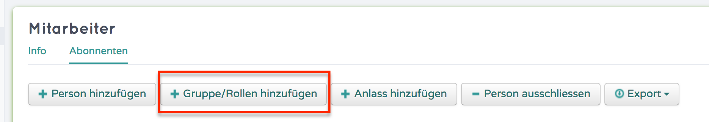
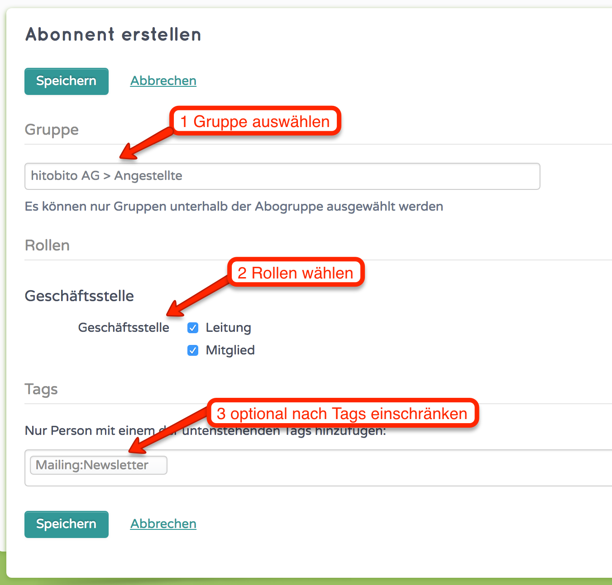

Mailinglisten / Abos
========================

Mit Mailinglisten / Abos können die Empfänger von Zeitschriften / Abos verwaltet werden, man kann sie auch für die interne Kommunikation benutzen.

Für Mailversände und das Verwalten von Abonnementen könnt ihr entsprechende Verteilerlisten erfassen.

Neues Abo erstellen
--------------------------

Mit den nötigen Berechtigungen könnt ihr im Tab "Abos" ein neues Abo erstellen.
Minimal muss ein Name für das Abo vergeben werden.
Falls das Abo für Mailversände verwendet werden soll, muss zudem unter "Mailinglisten Adresse"
eine Adresse eingetragen werden.

Absender-Rechte
~~~~~~~~~~~~~~~
Ohne weitere Konfiguration dürfen alle Personen, die das Abo bearbeiten können auch Mails an den Verteiler senden.
Kontrolliert wird dabei ob die im Absender eingetragene Mail-Adresse bei den berechtigten Kontakten als Haupt- oder weitere Mailadresse hinterlegt ist.

Die Mailadressen der Gruppe, zu dem das Abo gehört, dürfen ebenfalls jederzeit Mails an den Verteiler senden.

Zusätzliche Absender können mit folgenden Optionen berechtigt werden

1. Das Feld "Zusätzliche Absender": Mails mit den aufgeführten Absender-Adressen dürfen auf die Liste schreiben.
2. "Abonnenten dürfen auf die Mailingliste schreiben": Die bei den Abonnenten erfassten Mail-Adressen dürfen auf die Liste schreiben. 
3. "Beliebige Absender/-innen dürfen auf die Mailingliste schreiben": Alle, die die Abo-Adresse kennen, können Mails dorthin senden.

Empfänger zuweisen
-------------------------

In einem zweiten Schritt gilt es noch, die Empfänger dieses Abos zu bestimmen. Hierfür orientieren wir uns primär an den Organisationsstrukturen und den definierten Rollen.

Gruppe/Rolle hinzufügen wählen
~~~~~~~~~~~~~~~~~~~~~~~~~~~~~~~~~~~~~~~~~~~~~~~~

Nach Tags einschränken (optional)
~~~~~~~~~~~~~~~~~~~~~~~~~~~~~~~~~~~~~~~~~~~~~~~~

Mailversände
---------------------

Wenn ihr für das vorliegende Beispiel eine Einladung an alle Mitglieder der Region Bern versenden möchtet, könnt ihr diese an die gewählte E-Mail-Adresse senden. hitobito wird diese danach an die damit verknüpften Rollen, Anlässe etc. "weiterleiten". 

Im Abo kann definiert werden, wer auf das Abo schreiben dar. Nur Abonnenten auf der Mailingsliste, oder beliebige Absender*innen. Im Feld "Zusätzlicher Absender" kann definiert werden, wenn von weiteren E-Mail Adressen auf den Mailverteiler geschrieben werden kann.
Ein Beispiel:
Abo ist ein Präsidiumsverteiler mit sämtlichen Personen mit der Rolle Präsident*in. Da dürfen nur Personen welche im Abo sind drauf schreiben. Zusätzlich soll aber von info@hitobitokunde.ch auf dieses Abo geschrieben werden. In diesem Fall muss die Mailadresse info@hitobitokunde.ch in das Feld "Zusätzlicher Absender" eingetragen werden. Mittels Strichpunkt (;) können auch mehrere Adressen erfasst werden.

Etiketten drucken
----------------------

Falls ihr ein entsprechendes Etikettenformat definiert habt, könnt ihr diese im Abo unter "Export" auswählen, damit euch für physische Versände die Adressen der gewählten Mitglieder exportiert werden.

Mailinglisten nach Tags filtern
-------------------------------
Personen können beim hinzufügen via Rolle/Gruppe auch nach Tags gefiltert werden
