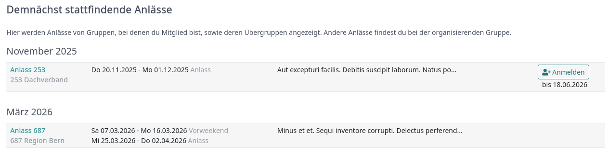
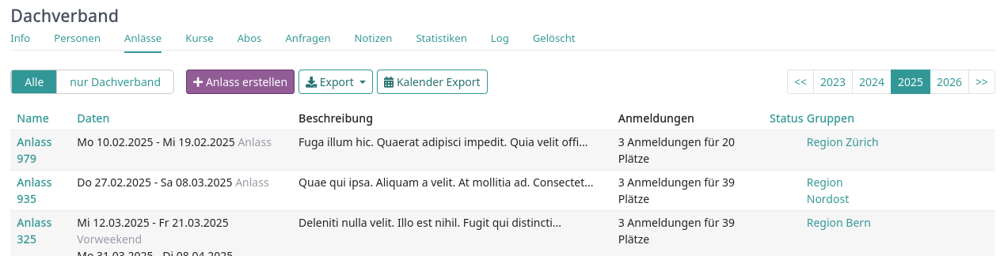
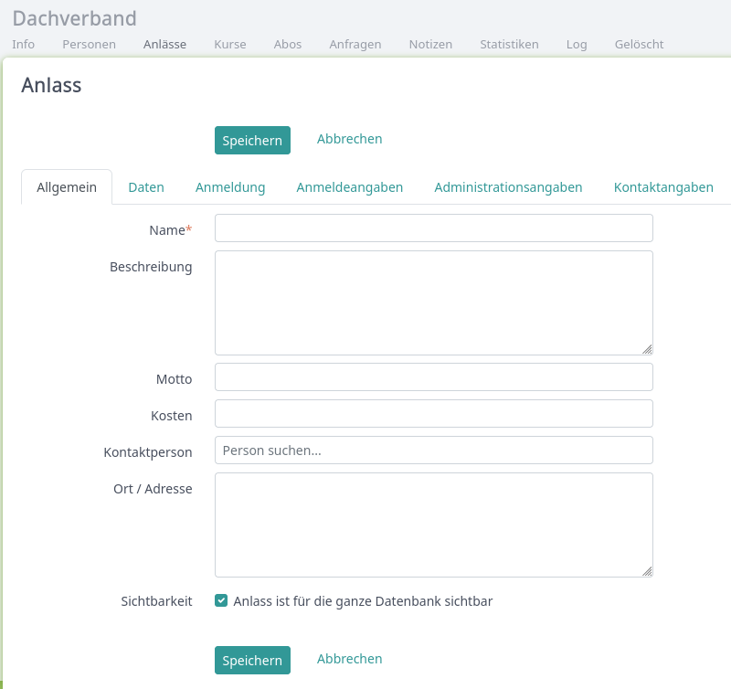
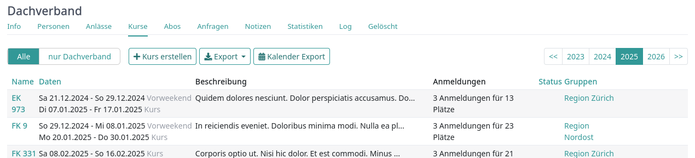
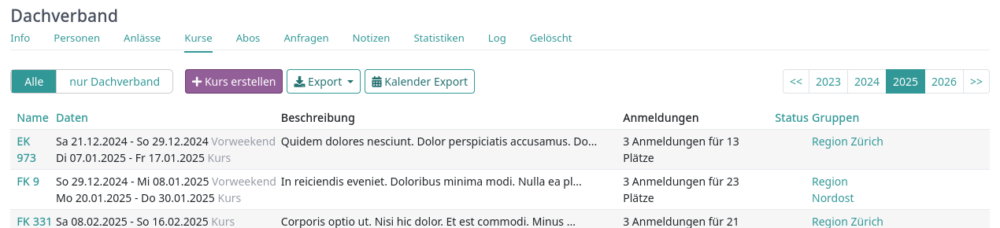
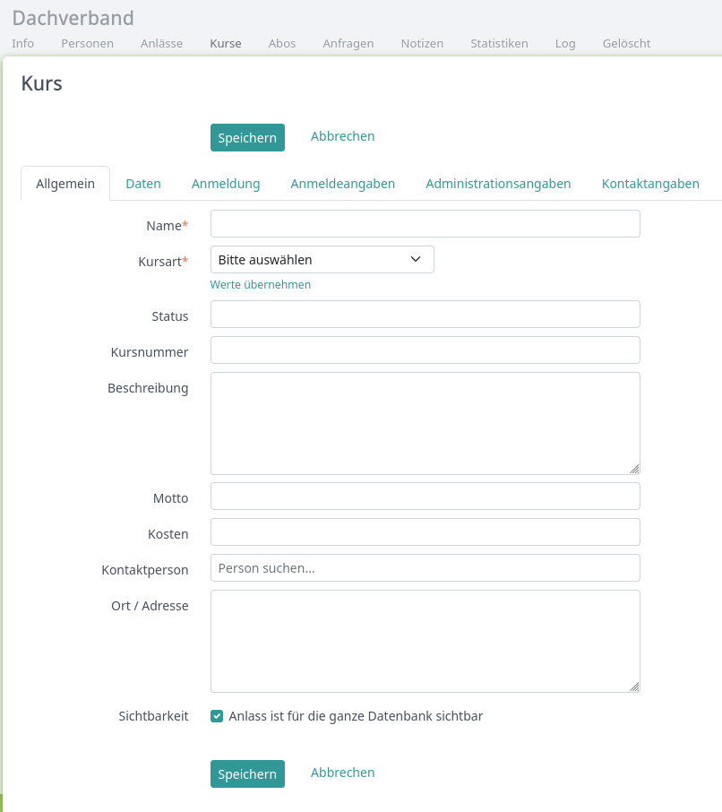
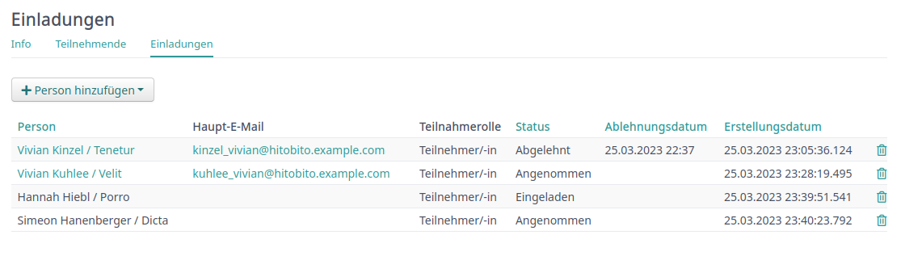
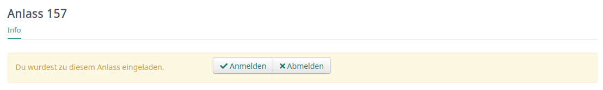
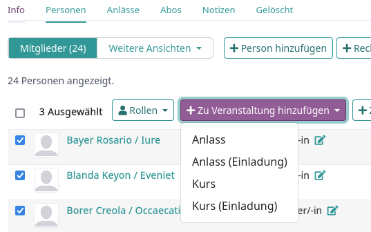

Administrieren
========================

Anlässe
-------

In Hitobito können unterschiedliche Arten von Events geführt werden. Einfache Anlässe und Kurse. Für gewisse Instanzen wurden zusätzliche Eventsarten wie Lager, Ferienlager oder Musikfeste ergänzt.

Unter „Anlässe“ findet siche eine Übersicht über Anlässe von Gruppen, bei denen man selbst Mitglied ist, sowie deren Übergruppen. Andere Anlässe finden sich bei der organsierenden Gruppe:

Hier kann man sich direkt für einen Anlass anmelden, sofern die Anmledung bereits freigegeben beziehungsweise der Anmeldeschluss noch nicht eingetreten ist.

Neuen Anlass erstellen
-----
Anlass erstellen in der gewünschten Gruppe, auf der entsprechenden Ebene:

Kurse
-------

Die Kurse bauen auf den Anlässen auf, sind durch zusätzliche Funktionen ergänzt. So können Anmeldebedingugen definiert werden und Teilnehmer können aufgrund ihrer angegebenen Priorität zugewiesen werden.

Unter „Kurse“ findet siche eine Übersicht über Kurse von Gruppen, bei denen man selbst Mitglied ist, sowie deren Übergruppen. Andere Anlässe finden sich bei der organsierenden Gruppe:

Hier kann man sich direkt für einen Kurs anmelden, sofern die Anmledung bereits freigegeben beziehungsweise der Anmeldeschluss noch nicht eingetreten ist.

Neuen Kurs erstellen
-----
Anlass erstellen in der gewünschten Gruppe, auf der entsprechenden Ebene:

Einladungen
-----------

Einladungen sind nützlich, wenn bestimmte Personen an einem Anlass oder Kurs teilnehmen sollten.
In diesem Fall können die Verantwortlichen diese Personen auf dem *Einladungen*-Tab hinzufügen.
Das *Einladungen*-Tab zeigt den Status aller eingeladenen Personen.

Die eingeladenen Personen können sich dann auf der Anlass-Seite für den Anlass an- oder abmelden.

Die eingeladenen Personen erhalten kein automatische Benachrichtigung,
da die Betroffenen wohl in vielen Fällen (z.B. Sitzungen, Generalversammlung)
separat ausführlich informiert werden müssen.

Über das Personen-Register der anbietenden Gruppe eines Anlasses oder Kurses
können auch mehrere Personen gleichzeitig hinzugefügt werden.

