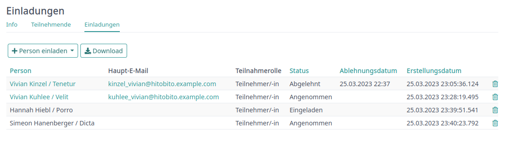

Administrieren
========================

In diesem Kapitel werden Spezialfunktionen erläutert, um Vereine zu verwalten. Diese sind nur für Personen sichtbar oder zugänglich, welche die entsprechenden Gruppenzugehörigkeiten und Rollen besitzen.

Personen
--------
Mitglied einer Gruppe zuweisen
~~~~~~~~~~~~~~~~~~~~~~~~~~~~~~
Um ein Mitglied einer neuen Gruppe zuweisen zu können, muss zuerst die entsprechende Gruppen angewählt werden. Unter „Personen“ gibt es dann die Möglichkeit eine Person hinzuzufügen:

.. image:: images/PersonHinzufügen.png

Zuerst soll die Person über das Suchfeld mit Namen gesucht werden.

Anhand des Namens wird eine treffende Auswahl der breits vorhandenen Mitgliedern mit Wohnort und Jahrgang angezeigt. Falls die gesuchte Person existiert, ist sie der gewünschten Gruppe, mit entsprechender Rolle, allenfalls einer weiteren Bezeichnung und dem Eintrittsdatum zuzuweisen.

Anschliessend empfiehlt es sich, die Angaben der Person zu prüfen und gegebenenfalls anzupassen. Hat das Mitglied noch keine Haupt-E-Mailadresse ist diese für den Login auf die Datenbank einzusetzen.

.. image:: images/PersonHinzufügen2.png

Neues Mitglied erfassen
~~~~~~~~~~~~~~~~~~~~~~~
Wenn ein neues Mitglied erfasst werden solle. Kann dies ebenfalls direkt über die entsprechende Gruppe erledigt werden.

.. image:: images/PersonHinzufügen.png

Unter „Neue Person erfassen“ können dann alle Daten der Person eingefügt und die passende Rolle zugeteilt werden.

.. image:: images/PersonHinzufügen3.png

Mitglieder bearbeiten
~~~~~~~~~~~~~~~~~~~~~
Personen mit Administratoren Rollen können die Daten sämtlicher Personen im Verein beziehungsweise der ihr zugeteilten Gruppen bearbeiten. Dazu ist die zu bearbeitende Person aufzurufen. In der Ansicht „Info“ findet sich der Button „Bearbeiten“:

.. image:: images/MitgliedBearbeiten.png

Haushalte verwalten
~~~~~~~~~~~~~~~~~~~
Haushalte ermöglichen Personen zusammen zu fassen, die in einem Haushalt wohnen. Anschliessend können die Personen bei Versanden zusammengefasst werden und Anpassungen an der Adresse gelten für alle Personen im Haushalt.

Haushalt erstellen
""""""""""""""""""
Um einen Haushalt zu erstellen wird am Besten eine Person ausgewählt bei der die Adresse bereits korrekt ist. Dann wird in der Rechten Spalte beim Abschnitt "Haushalt" auf "+ Erstellen" geklickt.
Anschliessend können alle Mitglieder des Haushalts gesucht und hinzugefügt werden.

**Wichtig**: Es können nur Kontakte hinzugefügt werden, auf die der eingeloggte Benutzer Schreibrechte hat.

.. image:: images/haushalt-erstellen.png

Haushalt bearbeiten
"""""""""""""""""""
Um die Adresse eines Haushalts zu ändern, kann ein beliebiges Mitglied des Haushalts, bearbeitet werden.
Wie im Hinweis geschrieben, gelten Änderungen an der Adresse für alle Personen im Haushalt.

.. image:: images/haushalt-warnung.png

Die Zusammensetzung eines Haushalts kann über den Abschnitte "Haushalt" bei einem beliebigen Mitglied geändert werden.

.. image:: images/haushalt-verwalten.png

Der "Verwalten"-Button öffnet bereits vom Erstellen bekannte Seite. Dort können weitere Mitglieder ergänzt oder einzelne entfernt werden.
Der "Aufläsen"-Button entfernt alle Mitglieder aus dem Haushalt, so dass deren Adressen wieder einzeln bearbeitet werden können.

Rollen bearbeiten
~~~~~~~~~~~~~~~~~
Um einem Mitglied eine neue aktive Rolle in einem Verein/Verband hinzuzufügen, in welchem das Mitglied bereits eine Rolle besitzt, kann unter „Aktive Rollen“ auf „Rolle hinzufügen“ geklickt werden. Es kann dann innerhalb der gewählten Gruppe dem Mitglied eine zusätzliche Rolle hinzugefügt und angegeben werden, seit wann die Rolle gültig ist.

Wenn das Mitglied bisher keine Rolle, im Bereich in dem sie eine neue Rolle erhalten soll, besitzt, muss sie direkt bei der entsprechenden Gruppe als Person hinzugefügt werden.

Um aktive Rollen zu entfernen, kann unter der Ansicht „Info“ im Abschnitt „Aktive Rollen“ das Symbol „Abfalleimer“ angewählt werden. Somit wird die aktuelle Rolle per sofort beendet.

Anlässe
-------

In Hitobito können unterschiedliche Arten von Events geführt werden. Einfache Anlässe und Kurse. Für gewisse Instanzen wurden zusätzliche Eventsarten wie Lager, Ferienlager oder Musikfeste ergänzt.

Unter „Anlässe“ findet siche eine Übersicht über Anlässe von Gruppen, bei denen man selbst Mitglied ist, sowie deren Übergruppen. Andere Anlässe finden sich bei der organsierenden Gruppe:

.. image:: images/AnsichtAnlaesse1.png

Hier kann man sich direkt für einen Anlass anmelden, sofern die Anmledung bereits freigegeben beziehungsweise der Anmeldeschluss noch nicht eingetreten ist.

Neuen Anlass erstellen
~~~~~~~~~~~~~~~~~~~~~~
Anlass erstellen in der gewünschten Gruppe, auf der entsprechenden Ebene:

.. image:: images/AnlassErstellen.png

.. image:: images/AnlassErstellen2.png

Gästefeature
~~~~~~~~~~~~~~~~~~~~~~
Im Core gibt es die Möglichkeit dass Personen ihre Gäste an Anlässe anmeleden können. Dieses Feature ist standardmässig nicht aktiviert, kann jedoch angefragt werden.

Beim erstellen oder bearbeiten eines Anlasses hat man die Möglichkeit zu definieren ob und wie viele Gäste pro angemeldete Person an diesem Anlass teilnehmen dürfen.

.. image:: images/Gäste2.png

Wer sich nun für den Anlass anmelden möchte kann entscheiden, ob er oder sie nur sich selbst oder noch andere Personen für diesen anmelden möchte

.. image:: images/Gäste3.png

Kurse
-------

Die Kurse bauen auf den Anlässen auf, sind durch zusätzliche Funktionen ergänzt. So können Anmeldebedingugen definiert werden und Teilnehmer können aufgrund ihrer angegebenen Priorität zugewiesen werden.

Unter „Kurse“ findet siche eine Übersicht über Kurse von Gruppen, bei denen man selbst Mitglied ist, sowie deren Übergruppen. Andere Anlässe finden sich bei der organsierenden Gruppe:

.. image:: images/AnsichtKurse.png

Hier kann man sich direkt für einen Kurs anmelden, sofern die Anmledung bereits freigegeben beziehungsweise der Anmeldeschluss noch nicht eingetreten ist.

Neuen Kurs erstellen
~~~~~~~~~~~~~~~~~~~~
Anlass erstellen in der gewünschten Gruppe, auf der entsprechenden Ebene:

.. image:: images/KursErstellen1.png

.. image:: images/KursErstellen2.png

Einladungen
-----------

Einladungen sind nützlich, wenn bestimmte Personen an einem Anlass oder Kurs teilnehmen sollten.
In diesem Fall können die Verantwortlichen diese Personen auf dem *Einladungen*-Tab hinzufügen.
Das *Einladungen*-Tab zeigt den Status aller eingeladenen Personen.

Die eingeladenen Personen können sich dann auf der Anlass-Seite für den Anlass an- oder abmelden.

.. image:: images/invitation_reply.png

Die eingeladenen Personen erhalten kein automatische Benachrichtigung,
da die Betroffenen wohl in vielen Fällen (z.B. Sitzungen, Generalversammlung)
separat ausführlich informiert werden müssen.

Über das Personen-Register der anbietenden Gruppe eines Anlasses oder Kurses
können auch mehrere Personen gleichzeitig hinzugefügt werden.

