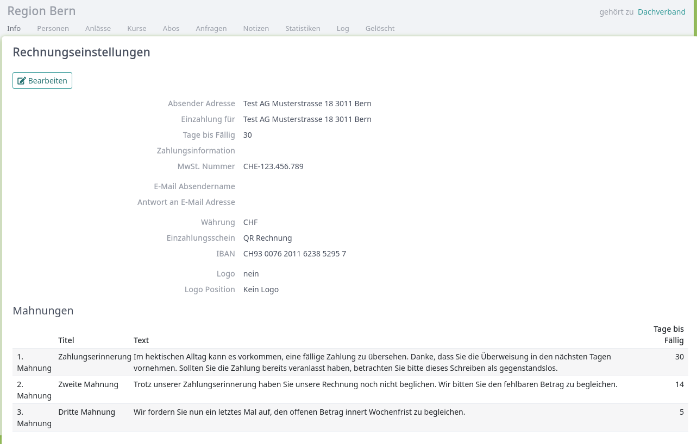
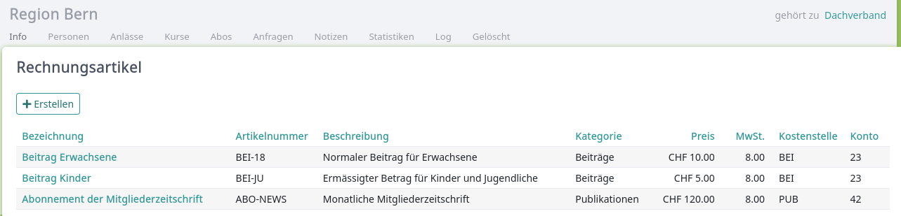
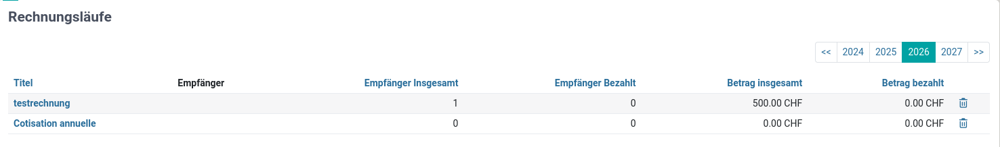
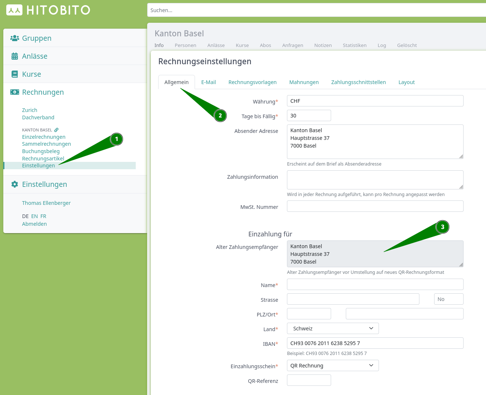

Rechnungen
================

In Hitobito können Debitoren verwaltet, Rechnungen erstellt und Zahlungen verbucht werden. Hitobito hat keine Buchhaltungsfeatures. Bei Bedarf können die Rechnungs- und Zahlungsdaten exportiert, oder eine Buchhaltungssoftware via Schnittstellen angebunden werden.

.. note:: Rechnungen sind ein Feature welches pro Instanz aktiviert werden kann. Ob eine Person Rechnungen verwalten kann hängt davon ab, ob sie eine entsprechende Rolle hat. Welche Rollen `:finance` Berechtigungen haben hängt von der jeweiligen Organisation ab.

Rechnungseinstellungen
--------------------------
In den Rechnungseinstellungen werden pro Ebene gültige Angaben gemacht. Hier werden die allgemeinen Rechnungseinstellungen verwaltet und Mahnungsfristen und -texte definiert. Zudem können Einstellungen zum Email-Versand und Rechnungslayout vorgenommen werden, sowie Zahlungsschnittstellen eingerichtet werden.

.. hint:: Damit Rechnungen versendet werden können müssen gültige Rechnungseinstellungen vorhanden sein.

Rechnungsartikel
---------------------------------------
Häufig verwendete Rechnungspositionen (z.B. Mitgliederbeitrag, Jahresabo, etc.) können hier pro Ebene vordefiniert werden. Diese Artikel können beim Erstellen von Rechnungen ausgewählt und individuell angepasst werden.

.. note:: Die Felder Kostenstelle und Konto haben in Hitobito keine Funktion. Sie sind lediglich für einen allfälligen Export in eine Buchhaltungssoftware vorhanden.

Rechnungen erstellen
--------------------------------------
.. hint:: Rechnungen werden nicht auf der Ansicht Rechnungen erstellt, sondern ausgehend von Personenlisten oder einer bestimmten Person.

Rechnungen können aus folgenden Ansichten erstellt werden:

- Personenlisten in einer **Gruppe**. Erstellt eine Einzelrechnung an die ausgewählten Personen.
- Teilnehmerlisten von einem **Event**. Erstellt eine Einzelrechnung an die ausgewählten Personen.
- Auf dem Profil einer **Einzelperson**. Erstellt eine Einzelrechnung an die ausgewählte Person.
- In einem **Abo**. Erstellt einen Rechnungslauf an die jeweiligen Empfänger des Abos.
- **Externe Rechnungen** erstellen in der Übersicht Einzelrechnungen. Erstellt eine Einzelrechnung. Diese wird keiner Person in Hitobito zugeordnet.

Rechnungen einsehen und bearbeiten
--------------------------------------

Rechnungen können in der Übersicht „Rechnungen“ eingesehen und bearbeitet werden. Hier wird zwischen Einzelrechnungen und Rechnungsläufen unterschieden.

Rechnungen können gestellt, gemahnt und per Email versendet werden. Dabei werden immer sämtliche ausgewählten Rechnungen gestellt oder gemahnt abhängig von ihrem aktuellen Status.

Hier können Rechnungen auch gedruckt oder exportiert werden, und es können Zahlungen erfasst werden.

Rechnungen werden in der Übersicht zusätzlich pro Rechnungslauf zusammengefasst. Dabei wird die Anzahl Empfänger, so wie die Anzahl und der Betrag der bezahlten Rechnungen angezeigt.

Die Rechnungen einer spezifischen Person können auch auf der jeweiligen Personenansicht eingesehen werden.

Zahlungen Erfassen
---------------------------------------
Zahlungen können auf drei verschiedene Arten erfasst werden.

Auf jeder Einzelrechnung können manuelle Zahlungen für die jeweilige Rechnung erfasst werden.

In der Übersicht Einzelrechnungen können camt.54 XML-Datei [#f2]_  hochgeladen werden. Diese erfassen die jeweiligen Zahlungen auf den dazugehörigen Rechnungen. Die Zahlungen werden auch erfasst, wenn es sich dabei um einen Rechnungslauf handelt.

Ist in den Rechnungseinstellungen eine Zahlungsschnittstelle eingerichtet, werden die Zahlungen nächtlich über die EBICS Schnittstelle mit der Bank abgeglichen.
Anleitung zum einrichten der EBICS Schnittstelle: https://hitobito.readthedocs.io/de/latest/ebics.html

Buchungsbeleg
---------------------------------------
Unter Buchungsbeleg wird eine rudimentäre Übersicht über die eingegangenen Zahlungen gegeben. Diese werden nach Rechnungsartikel sortiert. Dabei wird davon ausgegangen, dass gleiche Rechnungsartikel auch immer den gleichen Betrag aufweisen. 

Sammelrechnungen
---------------------------------------
Sammelrechnungen ermöglichen es, wiederkehrende Rechnungsläufe an eine Vielzahl von Empfängern zu versenden, wobei die Rechnungsbeträge automatisch basierend auf der Anzahl Rollen während einer definierten Abrechnungsperiode berechnet werden. Es gibt zwei Arten von Sammelrechnungen:

- **Sammelrechnung an Gruppen**: Jede passende Untergruppe erhält eine Rechnung, deren Betrag sich nach der Anzahl Personen mit einer bestimmten Rolle in dieser Gruppe richtet.
- **Sammelrechnung an Personen**: Jede Person in der Ebene erhält eine individuelle Rechnung basierend auf ihren Rollen.

.. note:: Sammelrechnungen sind ein optionales Feature, welches pro Instanz aktiviert werden muss. Auf SaaS-Umgebungen (https://\*.hitobito.com) ist dieses Feature nicht verfügbar.

**Einsatzszenario Gruppen**: Eine Dachorganisation möchte Mitgliederbeiträge an ihre Mitgliedsvereine verrechnen. Der Betrag pro Verein richtet sich nach der Anzahl Mitglieder während des Abrechnungsjahres. Ein Verein mit 10 Mitgliedern à CHF 10 erhält eine Rechnung über CHF 100.

**Einsatzszenario Personen**: Eine Gruppe möchte den Jahresbeitrag direkt an ihre Mitglieder verrechnen. Jede Person erhält eine individuelle Rechnung basierend auf ihren Rollen in der Gruppe.

Sammelrechnung konfigurieren
~~~~~~~~~~~~~~~~~~~~~~~~~~~~~
Sammelrechnungen werden im Bereich "Rechnungen" einer Ebene unter dem Menüpunkt "Sammelrechnungen" verwaltet. Über die Schaltflächen "Neue Sammelrechnung an Gruppen" bzw. "Neue Sammelrechnung an Personen" wird eine neue Sammelrechnung des jeweiligen Typs erstellt.

Eine neue Sammelrechnung wird mit folgenden Angaben konfiguriert:

- **Name**: Der Name der Sammelrechnung (kann in allen konfigurierten Sprachen erfasst werden).
- **Abrechnungsperiode**: Start- und optionales Enddatum der Periode, für welche Rollen gezählt werden. Eine offene Periode (ohne Enddatum) ist möglich.
- **Rechnungsempfänger**: Bei Sammelrechnungen an Gruppen wird der Gruppentyp der Empfänger gewählt (z.B. alle Gruppen vom Typ "Verein" unterhalb der rechnungsstellenden Ebene). Bei Sammelrechnungen an Personen werden alle Personen der aktuellen Ebene als Empfänger verwendet. Der Rechnungsempfänger kann nach dem Erstellen nicht mehr geändert werden.
- **Rechnungspositionen**: Eine oder mehrere Positionen, die den Rechnungsbetrag berechnen (siehe unten).

Rechnungspositionen (Rollen-Abrechnung)
~~~~~~~~~~~~~~~~~~~~~~~~~~~~~~~~~~~~~~~~~
Die Standardrechnungsposition "Rollen-Abrechnung" berechnet den Betrag basierend auf der Anzahl Personen, die während der Abrechnungsperiode eine bestimmte Rolle innehatten. Bei Sammelrechnungen an Gruppen wird pro Empfängergruppe gezählt; bei Sammelrechnungen an Personen erhält jede Person eine Rechnung für die ihr zugeordneten Rollen.

Jede Rechnungsposition hat folgende Felder:

- **Name** (kann mehrsprachig erfasst werden)
- **Einheitspreis**: Der Betrag pro Person mit der gezählten Rolle
- **Rollentypen**: Welche Rollentypen gezählt werden sollen
- **Kostenstelle** und **Konto**: Für den Export in Buchhaltungssoftware (haben in Hitobito selbst keine Funktion)

Pro Sammelrechnung können mehrere Rechnungspositionen mit unterschiedlichen Rollentypen und Einheitspreisen erfasst werden.

Rechnungslauf starten
~~~~~~~~~~~~~~~~~~~~~~
Auf der Detailansicht einer Sammelrechnung kann über "Rechnungslauf starten" ein neuer Lauf ausgelöst werden. Das System erstellt dabei automatisch für jeden Empfänger eine Rechnung. Bei Sammelrechnungen an Gruppen erhält jede Empfängergruppe des konfigurierten Typs eine Rechnung; bei Sammelrechnungen an Personen erhält jede Person in der Ebene eine individuelle Rechnung.

.. note:: Die berechneten Beträge werden beim Erstellen der Rechnungen fest gespeichert. Spätere Änderungen an Mitgliederdaten haben keinen Einfluss auf bereits erstellte Rechnungen.

Hinweise beim Erstellen eines Rechnungslaufs:

- Empfänger ohne gültige Adressdaten werden als Warnung angezeigt und erhalten keine Rechnung.
- Empfänger mit einem berechneten Gesamtbetrag von CHF 0 erhalten ebenfalls keine Rechnung.

Wiederholte Rechnungsläufe
~~~~~~~~~~~~~~~~~~~~~~~~~~~
Dieselbe Sammelrechnung kann mehrfach ausgeführt werden (Nachläufe). Das System verfolgt dabei, welche Personen oder Rollen bereits in früheren Läufen verrechnet wurden. Ein späterer Lauf verrechnet nur noch die Differenz – also Mitglieder, die seit dem letzten Lauf rückwirkend hinzugekommen sind – ohne dass bereits verrechnete Mitglieder doppelt in Rechnung gestellt werden.

Rechnungen an Gruppen einsehen
~~~~~~~~~~~~~~~~~~~~~~~~~~~~~~~~
Da Sammelrechnungen an Gruppen direkt an Gruppen adressiert sind, verfügt jede Gruppe über einen Tab "Rechnungen". Dort können alle Sammelrechnungen eingesehen werden, die dieser Gruppe zugestellt wurden.

Häufig gestellte Fragen:
---------------------------------------
Q1: Ich kann keine Rechnungen stellen oder Zahlungen erfassen. Wenn ich auf den Button "Rechnung erstellen" oder "Zahlung erfassen" klicke, geschieht nichts.

A1: Die Rechnungseinstellungen sind ungültig. Dafür unter "Rechnungen" auf "Einstellungen" klicken und dort folgendes anpassen:
Unter "Einzahlung für" die Daten aus "Alter Zahlungsempfänger" in die untenstehenden Pflichfelder eintragen. Danach speichern.

Q2: Ich kann keine Rechnungen erstellen. Die Gruppe als welche ich Rechnungen stellen mögcht ist ausgegraut.

A2: Für die ausgegraute Gruppe sind keine gültigen Rechnungseinstellungen vorhanden. Bitte aktuallisiere die Rechnungseinstellungen.

Q3: Ich kann meine Rechnungseinstellungen nicht speichern? 

A3: Vermutlich ist in einem anderen Tab der Rechnungseinstellungen noch eine falsche Information vorhanden. Probiere auf den verschiedenen Tabs die Rechnungseinstellungen zu speichern.

Q4: Ich kann eine Rechnung nicht mehr löschen?

A4: Eine Rechnung kann nur gelöscht werden, solange sie noch den Status "Entwurf" hat. Ein Rechnungslauf kann nur gelöscht werden, wenn noch alle darin enthaltenen Rechnungen den Status "Entwurf" haben. Hat eine Rechnung bereits einen anderen Status, kann diese nur noch storniert werden.

Q5: Eine Rechnung mit dem Status "Gestellt" wird nicht gemahnt, obwohl ich diese bei Mahnen ausgewählt hatte.

A5: Rechnungen werden nur gemahnt, wenn das Mahndatum erreicht wird. Sschaue in den Rechnungseinstellungen nach, wie lange nach Rechnungsdatum hier die Mahnfrist ist.

Q6: Nach dem Speichern meines Rechnungslaufs werden keine Rechnungen erstellt.

A6: Damit Rechnungsläufe erfolgreich erstellt werden können, muss mindestens eine Rechnungspositon einen Betrag aufweisen (Dieser Betrag kann 0 sein).

.. [#f2] Eine camt.054 XML-Datei ist die Sammelbuchungs-auflösung und Belastungs- und Gutschriftsanzeige. Diese enthält eine Reihe verschiedene Buchungspositionen welche automatisiert auf Basis der ESR-Nummer bestehenden Rechnungen zugeordnet werden.
