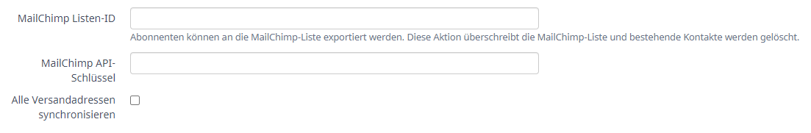
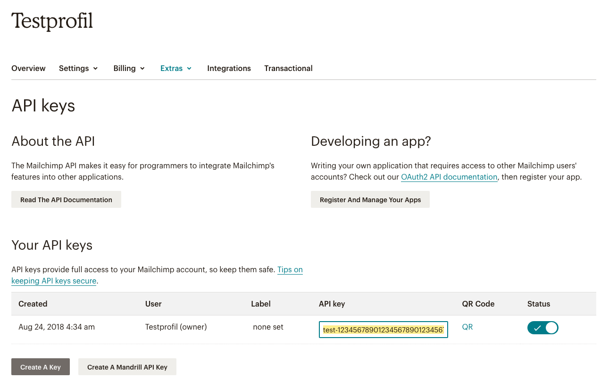
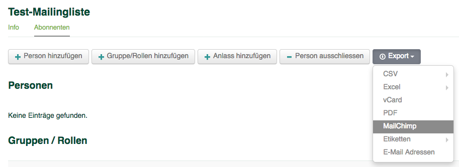

MailChimp-Export von Mailinglisten / Abos
=========================================

Mit dem MailChimp-Export können die Abonnent*innen von Mailinglisten exportiert werden in eine MailChimp-Liste.

Bitte beachtet vor Benutzung dieses Features zwei Dinge:

* Die MailChimp-Liste wird durch den Export **überschrieben** (siehe auch folgenden Abschnitt)
* Die MailChimp-Liste wird **regelmässig** (alle 24h) und bei Bedarf zusätzlich **auf Knopfdruck** exportiert

Grundsatz
---------

Das MailChimp-Feature ermöglicht es, die in Hitobito organisierten Daten zu brauchen, um mit MailChimp gestaltete Newsletter zu versenden. Es kann nicht gebraucht werden, um eine MailChimp-Liste mit einer Hitobito-Mailingliste zu synchronisieren, da es **keine Daten von MailChimp importiert** und **bestehende Daten von MailChimp bei jedem Export überschreibt**.

Verknüpfen einer Mailingliste mit MailChimp
-------------------------------------------

Mit jeder Mailingliste kann jeweils eine MailChimp-Liste verknüpft werden. Dies geschieht in den Einstellungen der Mailingliste durch die beiden Felder «MailChimp API-Schlüssel» und «MailChimp Listen-ID»:

.. hint:: Standardmässig werden nur die Haupt-E-Mailadressen der Abonnent*innen synchronisiert. Sollen weitere E-Mailadressen, welche die Option "Versand" haben ebenfalls mit MailChimp synchronisiert werden, ist die Option "Alle Versandadressen synchronisieren" anzuwählen.

Die **«MailChimp Listen-ID»** kannst Du in den Einstellungen der gewünschten Liste in MailChimp holen (in gelb unten rechts):

.. image:: mailing_lists_mailchimp_export/mailchimp_list_id.png

Der **«MailChimp API-Schlüssel»** ermöglicht es einer fremden Applikation wie Hitobito, in deinem Namen Änderungen in MailChimp vorzunehmen. Du kannst einen neuen API-Schlüssel im Menu «Extras / API keys» in den Einstellungen deines Profils erstellen. Auf der entsprechenden Seite kannst Du «Create A Key» drücken (im Bild unten links) und den «API key» aus dem Textfeld (im Bild gelb hinterlegt) in das entsprechende Feld in Hitobito kopieren:

Gratuliere, nach dem Speichern dieser zwei Informationen ist nun deine Mailingliste mit der MailChimp-Liste verknüpft!

Exportieren nach MailChimp
--------------------------

Um die Abonnent*innen einer Mailingliste nach MailChimp zu exportieren, wähle die entsprechende Option im «Export»-Menu des «Abonnenten»-Tabs deiner Mailingliste in Hitobito aus.

.. danger:: Bitte beachte, dass der Export deine verknüpfte Liste in MailChimp überschreiben. Bestehende Kontakte werden in Mailchimp archiviert.

Nach dem Auslösen des Exports wird die Liste im Hintergrund in die gewählte MailChimp-Liste exportiert und die Abonnent*innen deiner Mailingliste sollten nach einiger Zeit dort erscheinen.
Sollten E-Mailadressen in Mailchimp den Status "cleaned" besitzen, wird in hitobito ein entsprechender Validation Tag gesetzt. (z.B. "Haupt-E-Mail ungültig")

.. note:: Abonnent*innen Ihrer Mailingliste, welche sich in der Vergangenheit aktiv bei MailChimp von Ihrer Liste abgemeldet haben (über den Abmelden-Link in Ihrer E-Mail), behalten ihren «Unsubscribed»-Status und erhalten auch nach einem neuerlichen Export aus hitobito keine E-Mails mehr von Ihnen.
