Startseite Benutzer
==============================================

Übersicht
------------
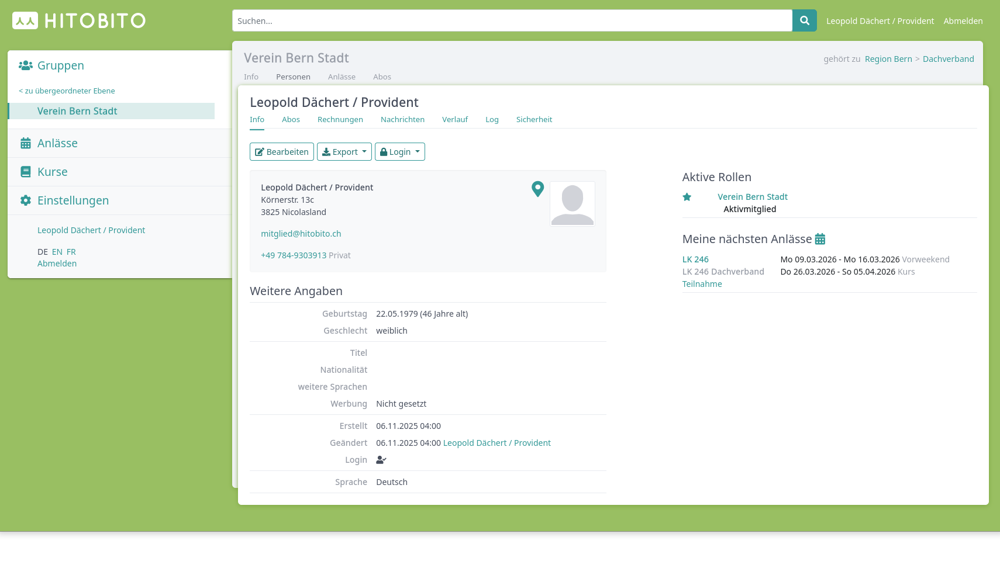

* Suchen: Im Suchfeld kann nach Personen, Vereinen, Verbänden, Anlässen, Kursen etc. gesucht werden.
* Sprachauswahl: Es kann zwischen den Sprachen Deutsch | Französisch | Italienisch umgeschaltet werden.
* Abmelden: Mit dem Abmelden-Link wird der Benutzer von hitobito abgemeldet.
* Logo: Ein Klick auf das Logo des Vereins bzw. Verbandes führt zur Startseite des Benutzers, d.h. zur Startseite der Hauptgruppe.

Ansicht Info
------------
In der Ansicht Info stehen, je nach Berechtigung, verschiedene Befehle zur Verfügung:

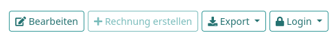

* Bearbeiten: Ändern der Angaben zur Person
* Löschen: Löschen der Person
* Rechnung erstellen: Erstellen einer Rechnung für diese Person
* Export: Herunterladen der angezeigten Daten in verschiedenen Formaten (CSV, PDF, Excel etc.).
* Login schicken: Dieser Befehl schickt dem Benutzer ein E-Mail mit dem Link zum setzen eines Passwortes. Fährt man mit der Maus über diesen Button erscheint die Information, ob der Benutzer bereits ein Login hat, oder nicht.

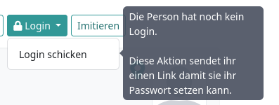

* Passwort ändern: Auf dem eigenen Profil, kann man unter Login sein Passwort ändern.

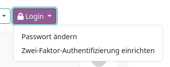

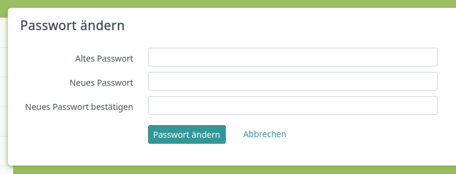

Notizen
------------
Im eigenen Profil, sowohl als auch in den Profilen anderer Personen können Notizen erfasst werden. Diese Funktion ist nicht für Mitglieder sondern nur für Personen mit Leitungs- oder Administrationsrolle nutzbar.

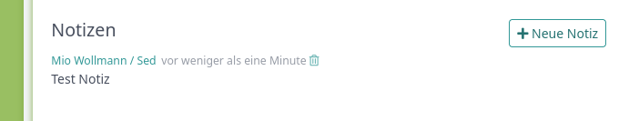

Ansicht Abos
------------
Auflistung, in welcher Mailingliste der Benutzer eingetragen ist. Mehr dazu...

Ansicht Rechnungen
------------
In der Ansicht „Rechnungen“ finden sich alle Rechnungen, welche an diese Person geschickt wurden. Diese Ansicht ist jedoch nur für gewisse Rollen verfügbar.

Ansicht Nachrichten
------------
In der Ansicht „Nachrichten“ wird ersichtlich, welche Mailings eine Person bisher erhalten hat. Es werden nur Mailings angezeigt, die die Person über einen Verteiler also ein Abo aus der Datenbank erhalten hat.

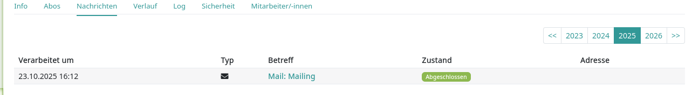

Ansicht Verlauf
------------
In der Ansicht „Verlauf“ findet sich eine Übersicht aller Gruppen, welchen eine Person aktuell und in der Vergangenheit angehörte und die entsprechende Rolle, die sie Inne hatte. Bei vergangenen Rollen in ein Von- und Bis-Datum vermerkt; bei aktuellen Rollen nur ein Von-Datum.

Ebenfalls werden hier die Anlässe und Kurse der entsprechenden Person ausgelistet ist, zu welchen sie anmgeldet ist bzw. war.

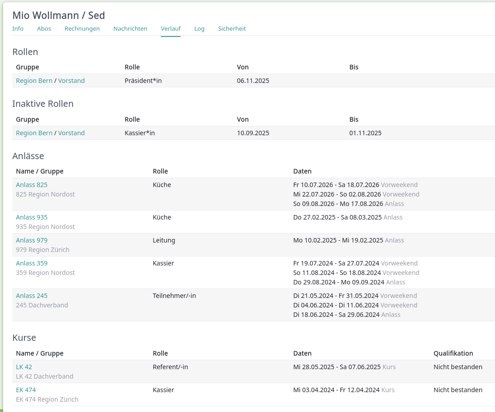

Ansicht Log
------------
In der Ansicht „Log“ kann nachverfolgt werden, wer wann welche Informationen im Profil angepasst hat.

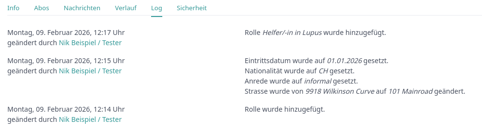

Ansicht Sicherheit
------------
In der Ansicht „Sicherheit“ können verschiedene Informationen abgeholt und folgende Aktonen getätigt werden:
* Passwort überschreiben: Über diesen Button wird das aktuelle Passwort überschrieben und die Person kann sich über die Funktion „Passwort zurücksetzen“ ein neues zusenden lassen.
* Login sperren: Über diese Ansicht gibt es die Möglichkeit die Haupt-E-Mail einer Person gelöscht werden, diese kann später wieder hinzugefügt werden.

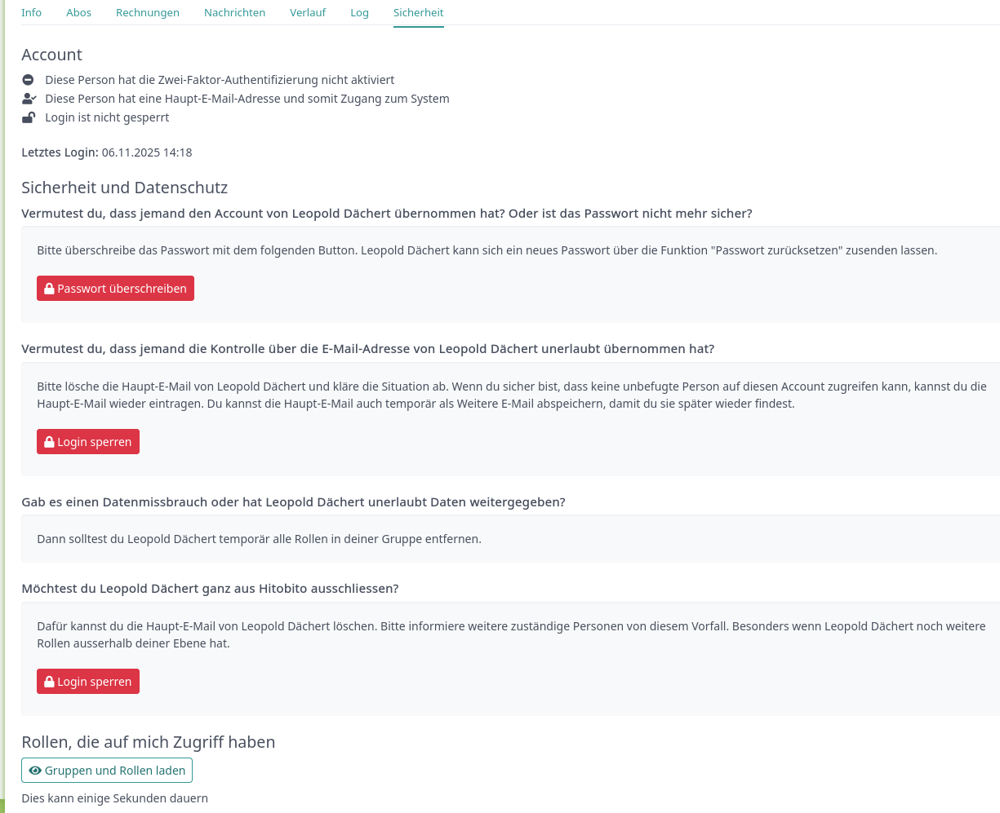

Gruppen
==============================================

Menu Info
------------
Unter dem Menupunkt „Info“ kann für jede Gruppe eine Kontaktperson ausgewählt oder eine „Vereinsadresse“ definiert werden.

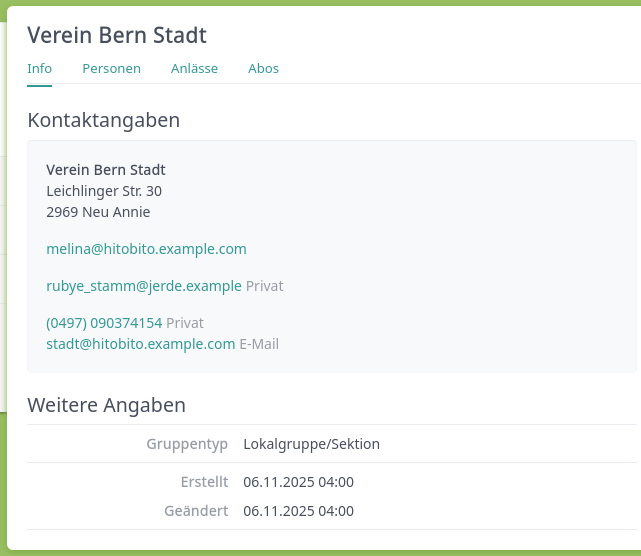

Menu Personen
------------
Im Menu „Personen“ werden - bei einem eigenen Verein - in der Grundeinstellung alle Mitglieder der Gruppe mit einer bestimmten Funktion angezeigt. Dieser Menupunkt ist bei fremden Vereinen nicht sichtbar.

Über den Button „Spalten“ kann eingestellt werden, welche Angaben in der Übersicht angezeigt werden sollen. Mit den Befehelen „Export“ bzw. „Drucken“ können die angezeigten Daten heruntergeladen werden bzw. ausgedruckt werden.

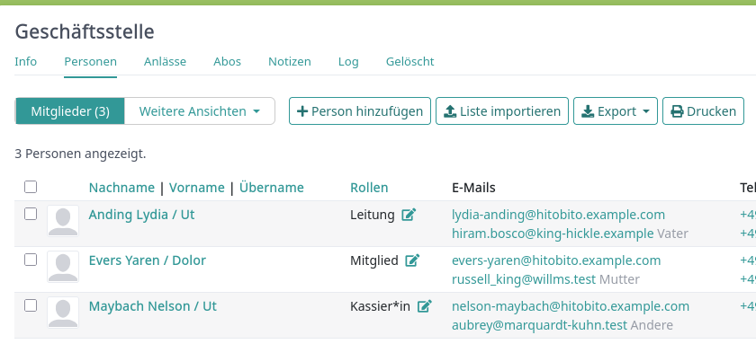

Über die Funktion „Weitere Ansichten“ können alle Personen („Gesamte Ebene“) angezeigt oder Filter gesetzt werden.

Beispiel: Ist die Gruppe „Mitglieder“ eines eigenen Vereins ausgewählt, werden alle Personen dieser Gruppe angezeigt, also die Liste aller Aktivmitglieder.

Bei der Gruppe „Vorstand“, werden alle Personen dieser Gruppe angezeigt, also die Liste aller Vorstandsmitglieder.

Wird eine oder mehrere Personen markiert (Haken ganz links in der Liste), erscheinen weitere Befehle, mit welchen alle markierten Personen gleichzeitig bearbeitet werden können:

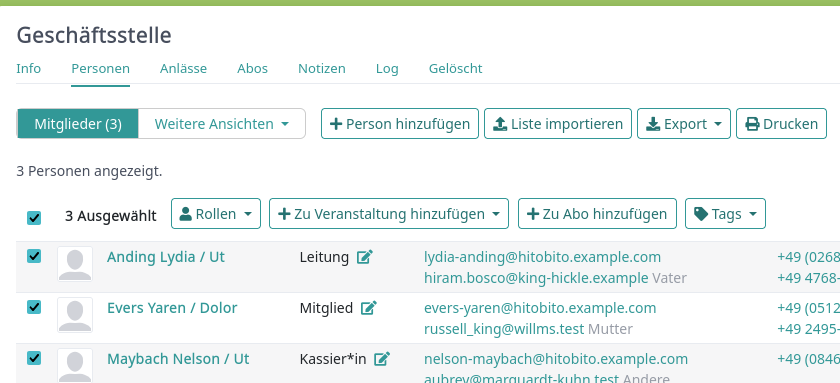

Menu Anlässe
------------
Unter dem Menupunkt „Anlässe“ werden die Anlässe, welche von der angezeigten Gruppe erstellt, bzw. von der jeweiligen Untergruppe erstellt wurden, aufgelistet. Hier können sich die Mitglieder für die Anlässe anmelden, die Anlässe exportieren oder direkt in den Kalender eitnragen (mit Hilfe einer iCalender-Datei).

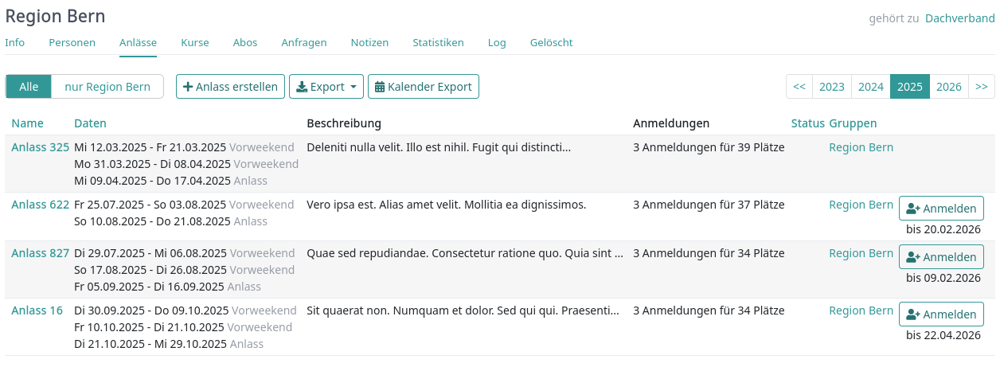

Menu Kurse
------------
Unter dem Menupunkt „Kurse“ werden die Kurse, welche von der angezeigten Gruppe erstellt, bzw. von der jeweiligen Untergruppe erstellt wurden, aufgelistet. Hier können sich die Mitglieder für die Kurse anmelden, die Anlässe exportieren oder direkt in den Kalender eitnragen (mit Hilfe einer iCalender-Datei).

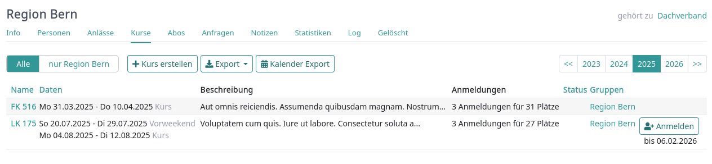

Menu Abos
------------
Unter dem Menupunkt „Abos“ können Abos für bestimmte Gruppen erstellt werden. Diese können dann dafür genutzt werden, Mailings an diese definierten Gruppen senden zu können.

Um ein Abo anzulegen, muss zwingend ein Name für die Gruppe definiert werden. Zudem muss festgelegt werden, ob und welche Mitglieder sich eigenständig für dieses Abo an- und abmelden können.

.. image:: images/MenuAbos.png

Für das Abo kann des weiteren eine E-Mail-Adresse für die Mailingliste definiert werden. Des weiteren können Personen definiert werden, welche Nachrichten über diese Mailingliste verschicken können.

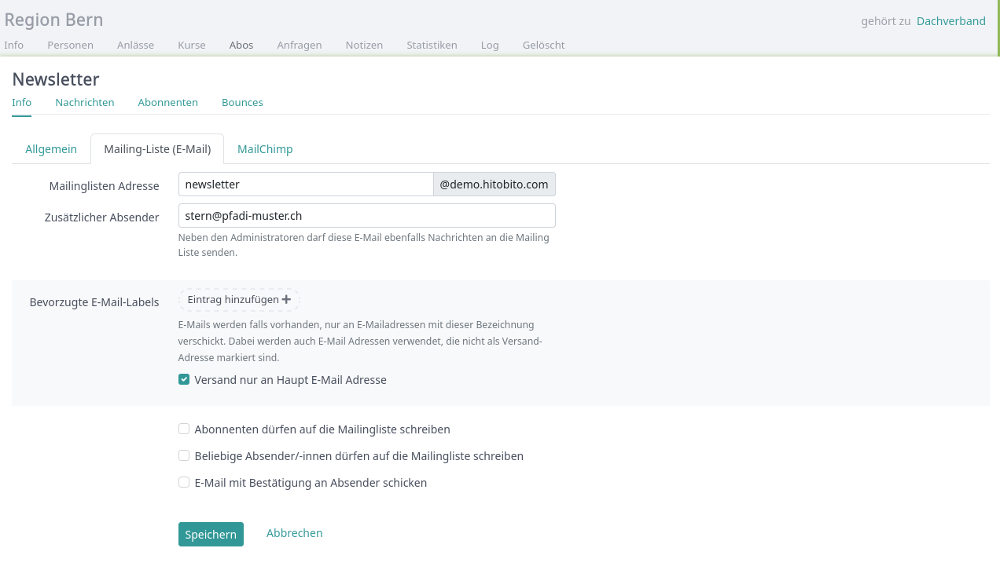

Rollen
==============================================

Rollen sind ein zentrales Konzept in hitobito:

-  Jede Person kann beliebig viele Rollen in verschiedenen Kontexten
   haben. Peter kann z. B. gleichzeitig Leiter eines Gremiums in einem
   Kantonalverband sein, als auch Mitglied in einer Ortsgruppe.
-  Welche Rollen zur Verfügung stehen, hängt davon ab, in welcher Gruppe
   du die Person zuweist. Z. B. hat eine Gruppe vom Typ Vorstand Rollen
   wie PräsidentIn und SekretärIn zur Verfügung.
-  Die Rolle der Person bestimmt die `Zugriffsrechte`_ dieser Person.

Empfehlungen
------------

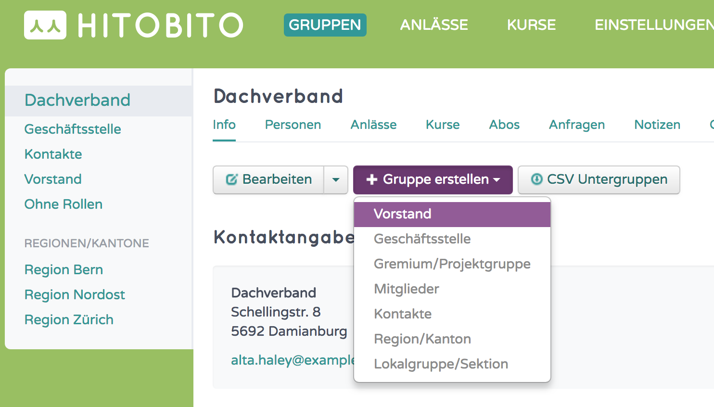

Für jede Organisation stellen wir die passenden Rollen bereit. Versuch
also möglich die passende Art von Gruppentyp auszuwählen, damit du dort
der Person die richtige Rolle zuweisen kannst.

Eigene Bezeichnungen für Rollen
-------------------------------

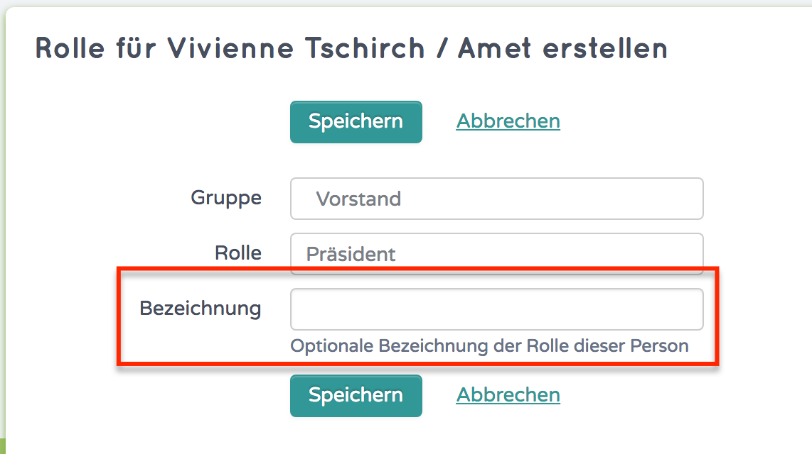

Du kannst neben der offiziellen Rollenbezeichnung noch deine eigene
ergänzen, indem du im Rollendialog das zusätzliche Feld ausfüllst.

Nach diesen Bezeichnung kann allerdings aktuell noch nicht gefiltert
werden.

.. _Zugriffsrechte: https://hitobito.readthedocs.io/de/latest/access_concept.html#berechtigunskonzept
