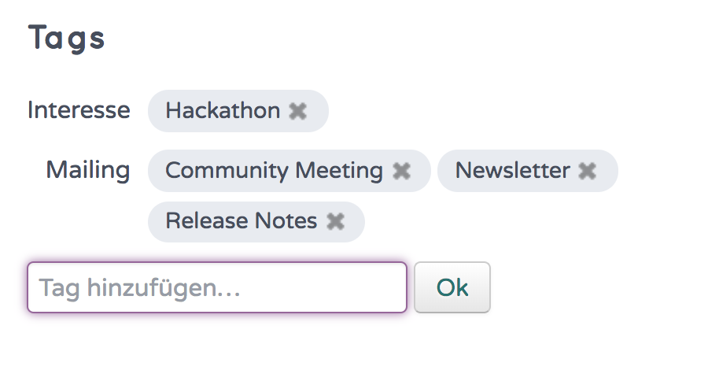

Tags
=====

Mit Tags (engl. für Etikett, Schildchen) lassen sich in hitobito Kategorien oder Merkmale auf Personen abbilden. Tags sind nicht strukturierte Informationen und können frei definiert werden. Um Tags zu vergeben, sind schreibrechte auf der Person erforderlich.

Erfassen von Tags
----------------------

Beim Erfassen der Tags könnt ihr die Kategorie direkt eingeben oder auch Unterkategorien bilden.

Bsp.: 

- Tag "Newsletter" vergeben, falls diese Person einen Newsletter erhalten soll.
- Tag "Mailings: News" oder "Mailings: Events" vergeben, wenn es Newsletter für verschiedene Fälle gibt.

Verwalten von Tags
--------------------------------

Als Administrator können die Tags unter Einstellungen für die ganze Instanz erstellt, bearbeitet, gelöscht und zusammengeführt werden.

Personen mit Tags auswählen
--------------------------------

Auf der Personenlisten können nach Tags gefilter werden. Weiter können bei Mailinglisten/Abo Personen aufgrund der gesetzten Tags ausgewählt werden.
